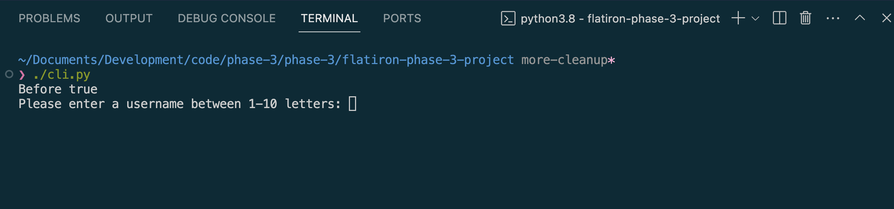

# Table 4 Phase 3 Project

## Home

* [Dependencies](#dependencies)
* [Starting the Application](#starting-the-application)
* [Using the Application](#using-the-application)
* [Instructions](#instructions)
* [License](#license)
* [Attributions](#attributions)
* [What I Learned](#what-i-learned)

## Intro To Project

- This is a project where a user can play various games in their terminal.
- This project was made to complete the assignment `Phase 3 Project` for the `SE-West-091123` class for the [Flatiron](https://flatironschool.com/) Software Engineering Boot Camp.
- The project was completed using the following: `python`, `sqlite3`.

## Dependencies

- The following is needed to run this application: `pyenv`, `python`, `sqlite3`.

- You must have access to these dependencies in the directory that you are running this application in. If your environment does not have these requirements, you may install them in this order by going to these websites and following the installation instructions:

- [pyenv](https://realpython.com/intro-to-pyenv/#installing-pyenv)

- [python](https://www.python.org/)

- `sqlite3` should come standard on `macOS`. You can check by typing `which sqlite3` in the terminal. If you do not see a response like `/usr/bin/sqlite3` then you probably need to install it. Go here to do so [codecademy - install sqlite on mac](https://www.codecademy.com/resources/videos/setting-up/how-to-install-sqlite-on-mac)

- To install `sqlite3` on a `windows` machine, go here [codecademy - install sqlite on windows](https://www.codecademy.com/resources/videos/setting-up/how-to-install-sqlite-on-windows)

## Starting the Application

- Open a terminal window in the main directory of where this project is located on your computer.
- Run `pipenv install`.
- Then run `./cli.py`
- It should take you to the main menu of this app that looks like this:
- ==============================================
    
- ==============================================
- If the name you type in exists in the player table of the database, the app will log you in as that player.
- If the name does not exist, the app will create a new player in the database.
- After logging in the app should take you to the main menu of this app that looks like this:
- ==============================================
    
- ==============================================

## Using the Application

- You can select any of the available options listed in the menu by selecting the appropriate number.
- You can play any of the games or review table information associated with the player

## Instructions

- [Wordle Guide](https://www.ign.com/wikis/wordle/Wordle_Beginner%E2%80%99s_Guide_and_Tips)
- [How to play Minesweeper](https://www.howtogeek.com/how-to-play-minesweeper/)
- [How to play Hangman](https://www.wikihow.com/Play-Hangman)
- Instructions for `Anagrams`:
    - You get a list of letters located at the top of the terminal. You have one minute to make as many words as you can out of the letters listed. You can only use a letter once for each time it appears in the list. For ex., if there is only one 's' in the list you cannot choose the word 'chess' as a valid answer. Answers must be at least 2 letters long. You receive more points, and more bonus points, for longer words.

## License

- This project is is made in conjunction with the standard `MIT` license provided by `GitHub` upon creation of a new repository. A copy of the license is included with this project in a file named: `LICENSE`.

## Attributions

- The project was authored by: `Danner Baumgartner`, `Isaac Song`, and `Brian Richie Sr.`
- This project was created with combination of skills learned from the `Flatiron` curriculum and our own individual research.
- The data used to seed the original data prior to being modified for the purposes of this project was supplied by [Dracos](https://gist.github.com/dracos/dd0668f281e685bad51479e5acaadb93) created by `M Somerville`. The data consisted of an expansive file of 5-letter words for our version of [Wordle](https://en.wikipedia.org/wiki/Wordle) created by `Josh Wardle`.
- We used [Array_This](https://arraythis.com/) created by `populu` to convert the data in an iterable list to easily store each word in our database.
- We used [Free Dictionary Api](https://dictionaryapi.dev/) created by [Suraj (github handle - meetDeveloper)](https://github.com/meetDeveloper) to check the validity of each word entered by the user in the `Anagrams` game.
- We used [Hangman](https://github.com/Xethron/Hangman/blob/master/words.txt) created by [Bernhard Breytenbach (github handle - Xethron)](https://github.com/Xethron) to seed the database with Hangman words and phrases
- And of course, thank you [Stack Overflow](https://stackoverflow.com/).

## What I Learned

- `Danner`: Working with python has truly been an awesome experience. Aside from some getting used to and some finnickey behavior, its an awesome language all around and definitely very beginner friendly. This project has been so much fun to work on, and i can see my teammates passion for code really show. Im so grateful to be a part of the community at `Flatiron` and im super excited to learn more, and see what the rest of the phases have to offer.
- `Isaac`: Transitioning from web development using JavaScript and React to object-oriented programming using Python has been an intense learning experience. It was very fun learning how to display text inside of a terminal as opposed to displaying colors or images on a website. Python has opened up endless possibilities to what application I can create. With amazing help of Brian and Danner, we were able to use intricate algorithms to create the logic for the games in our application and display the game in the terminal. I am grateful for the `Flatiron` community for bringing this opportunity and I look forward to diving deeper into the world of programming!
- `Brian`: I learned a lot more about the versatility of `Python` in its ability to interface with `SQL` databases and the terminal directly. I can see the potential of combining `Python` with a front-end langauge to make some incredible apps. The team was great. We collaborated well and were very supportive of each other's struggles with completing this project. We also inspired one another's creativity throughout this process. Thank you Danner, Isaac, and the `Flatiron` community.

* [Back To Top](#table-4-phase-3-project)
